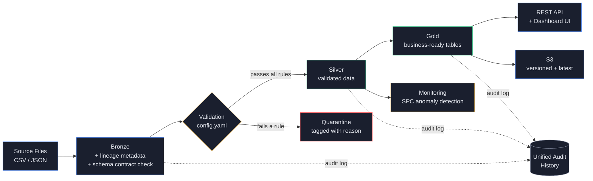

<div align="center">

# NovaMed Regulated Life-Sciences Data Lakehouse

**A production-style medallion architecture pipeline for a regulated medical-device manufacturer, built end to end in Python.**


[Quickstart](#quickstart) · [Architecture](#architecture) · [Results](#results) · [API](#rest-api--dashboard-ui) · [Full Feature List](#full-feature-list)

</div>

---

## Why this project

Regulated industries — pharma, medical devices, finance — can't just move data around. Every record needs a traceable origin, every rejection needs a documented reason, and every pipeline run needs to be provable after the fact. This project builds that discipline from scratch: a fictional medical-device manufacturer's lab, batch, supplier, and device-quality data flows through a bronze → silver → gold pipeline with full lineage, config-driven validation, quarantine (never silent deletion), statistical anomaly detection, and a live API — all backed by 29 automated tests and CI that runs the entire pipeline from a clean checkout on every push.

> **Disclaimer:** Fully synthetic data. Not an FDA-validated system, does not claim GxP or 21 CFR Part 11 compliance. It demonstrates the *engineering patterns* — traceability, auditability, validation, error handling — that regulated environments require.

---

## Architecture



Every row is accounted for at every stage: it either lands in Silver, or it lands in Quarantine with a documented reason. Nothing is ever silently dropped, and every run — bronze, silver, gold — writes to a unified, queryable audit history.

---

## Results

Every claim below is reproducible by running the pipeline yourself — see [Quickstart](#quickstart).

| Table | Bronze (raw) | Silver (passed) | Quarantined | Pass Rate |
|---|---:|---:|---:|---:|
| batches | 120 | 118 | 2 | 98.3% |
| lab_tests | 701 | 696 | 5 | 99.3% |
| device_events | 501 | 497 | 4 | 99.2% |
| quality_deviations | 180 | 178 | 2 | 98.9% |
| supplier_inspections | 250 | 248 | 2 | 99.2% |
| document_metadata | 100 | 98 | 2 | 98.0% |
| **Total** | **1,852** | **1,835** | **17** | **99.1%** |

**Gold layer:**
- `batch_quality_summary` — 118 batches enriched with test pass rates and open deviation counts
- `supplier_scorecard` — 5 suppliers scored on inspection pass rate and defect totals
- `deviation_summary_by_severity` — deviation counts by severity and status

<details>
<summary><b>Data quality rules (click to expand)</b></summary>

All rules live in `config.yaml`, not hardcoded in pipeline scripts — thresholds and allowed values change without touching code.

| Table | Rule | Example caught |
|---|---|---|
| batches | `batch_id` must not be null | 1 row with missing ID |
| batches | `expiry_date` must be after `manufacture_date` | 1 row with equal dates |
| lab_tests | `result` must be PASS, FAIL, or PENDING | 1 row with `"UNKNOWN"` |
| lab_tests | `measurement_value` must be between 0 and 200 | 1 row at `999.99` |
| lab_tests | `test_date` must parse as a valid date | 1 row with `"not-a-date"` |
| lab_tests | exact duplicates quarantined, not dropped | 1 duplicate row |
| device_events | `severity` must be a known value | 1 row with `"EXTREME"` |
| device_events | `device_id` must not be null | 1 row with missing ID |
| device_events | `event_timestamp` must parse as valid | 1 row with `"invalid-timestamp"` |
| quality_deviations | `severity` must be a known value | 1 row with `"URGENT"` |
| supplier_inspections | `inspection_result` must be PASS or FAIL | 1 row with `"UNKNOWN"` |
| document_metadata | `approval_status` must be a known value | 1 row with `"SIGNED_OFF"` |

</details>

---

## Full Feature List

<table>
<tr><td>

**Core pipeline**
- [x] Bronze ingestion, lineage metadata, schema contracts
- [x] Silver validation, quarantine, duplicate handling
- [x] Gold business-ready summary tables
- [x] Unified cross-layer audit history
- [x] Full data dictionary

</td><td>

**Engineering rigor**
- [x] 29 automated tests (pytest)
- [x] CI on every push (GitHub Actions)
- [x] Config-driven data contracts
- [x] Full Docker containerization

</td></tr>
<tr><td>

**Serving layer**
- [x] Interactive Plotly dashboard
- [x] REST API (read + write) — FastAPI
- [x] Custom dashboard UI over the API

</td><td>

**Advanced capability**
- [x] Statistical process control monitoring + anomaly detection
- [x] Incremental processing with checkpoints
- [x] AWS S3 cross-cloud publishing

</td></tr>
</table>

---

## Monitoring & Anomaly Detection

Statistical process control (SPC), the same technique used on real regulated manufacturing lines: a rolling mean and standard deviation of pass rate per table, flagging any run that breaches a hard 95% threshold **or** a statistical lower control limit (mean − 2σ).

A simulated 14-day history (`src/simulate_history.py`) ran at a stable 1–2% baseline defect rate, with a deliberate incident injected on day 11 (14%) and partial recovery on day 12 (6%). Result: **all six tables correctly flagged on day 11**, five still flagged on day 12 as the incident resolved, **zero false positives** across the 12 clean days. Full trend visualization in `docs/monitoring_dashboard.html`.

## Incremental Processing

`src/bronze_ingestion_incremental.py` tracks a per-table checkpoint and only ingests rows arriving after it — no full reprocessing. Proven end to end by `src/demo_incremental.py`: baseline run processes everything, an immediate rerun skips every table (nothing changed), then 15 new rows are appended and the next run processes **only those 15**, leaving every other table untouched.

## Cross-Cloud Publishing (AWS S3)

`src/upload_to_s3.py` publishes the gold layer and audit history to S3 twice — a timestamped `runs/<timestamp>/` path for point-in-time versioning, and a `latest/` path for downstream consumers who always want current data. `src/download_from_s3.py` proves the round trip: row counts match exactly on the way back down. Credentials load from a local `.env` (never committed — see `.env.example`), scoped to a dedicated IAM user.

---

## REST API & Dashboard UI

A FastAPI service exposes the lakehouse over HTTP, with a custom dark-themed dashboard UI built on top — not just the auto-generated `/docs` page.

| Endpoint | Description |
|---|---|
| `GET /batches` | Filterable, paginated batch quality data |
| `GET /suppliers` | Supplier scorecards |
| `GET /quarantine/{table}` | Rejected records with failure reasons |
| `POST /deviations` | Open a new quality deviation |
| `PATCH /batches/{id}/status` | Update batch status |
| `POST /device-events` | Log a new device event |

Writes append to the same source files the batch pipeline reads — anything submitted through the API gets validated by the exact same `config.yaml` rules as batch-loaded data. One data contract, two ingestion paths.

```bash
uvicorn src.api:app --reload
# UI:  http://127.0.0.1:8000/
# Docs: http://127.0.0.1:8000/docs
```

---

## Quickstart

```bash
git clone https://github.com/Dheeraj1412/regulated-life-sciences-lakehouse.git
cd regulated-life-sciences-lakehouse
python3 -m venv .venv && source .venv/bin/activate
pip install -r requirements.txt

# Run the full pipeline
python src/generate_synthetic_data.py
python src/bronze_ingestion.py
python src/silver_validation.py
python src/gold_modeling.py

# Explore
python src/audit_summary.py          # unified audit history
python src/build_dashboard.py        # interactive quality dashboard
python -m pytest tests/ -v           # 29 tests
```

<details>
<summary><b>Run with Docker instead</b></summary>

```bash
docker build -t novamed-lakehouse .
docker run --rm novamed-lakehouse
```

Runs the entire pipeline plus the full test suite inside an isolated container — no local Python setup required.

</details>

---

## Project Structure
regulated-life-sciences-lakehouse/
├── data/
│   ├── source/              raw synthetic source files
│   └── lakehouse/
│       ├── bronze/          raw data + lineage metadata
│       ├── silver/          validated data + audit log
│       ├── quarantine/      rejected rows with reasons
│       ├── gold/            business-ready summary tables
│       └── monitoring/      SPC trends and alerts
├── src/
│   ├── generate_synthetic_data.py
│   ├── bronze_ingestion.py            bronze_ingestion_incremental.py
│   ├── silver_validation.py
│   ├── gold_modeling.py
│   ├── audit_summary.py
│   ├── build_dashboard.py             monitoring_dashboard.py
│   ├── simulate_history.py            monitor.py
│   ├── upload_to_s3.py                download_from_s3.py
│   ├── api.py                         static/index.html
│   └── pipeline_summary.py            demo_incremental.py
├── tests/test_pipeline.py
├── docs/                     data_dictionary.md, dashboard.html, monitoring_dashboard.html
├── .github/workflows/        tests.yml
├── config.yaml                data quality rules
├── Dockerfile
└── requirements.txt

---

## Technology Stack

Python · pandas · PyArrow · PyYAML · Plotly · FastAPI · pytest · GitHub Actions · Docker · boto3 (AWS S3)

Designed to be portable to **PySpark + Delta Lake** for production-scale deployment on Databricks or Microsoft Fabric — the transformation logic is the same; only the execution engine changes.

## Data Sources

Manufacturing batches · Laboratory test results · Device quality events · Quality deviations · Supplier inspections · Controlled-document metadata

---

<div align="center">

Built as an end-to-end portfolio project — every number in this README is reproducible.

</div>
